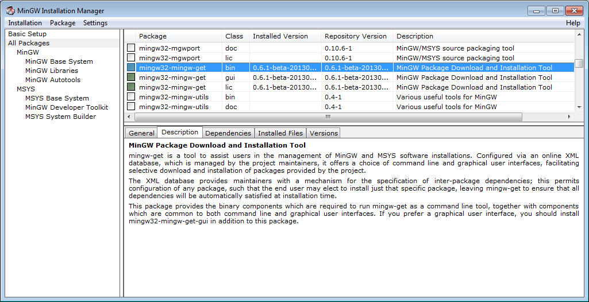
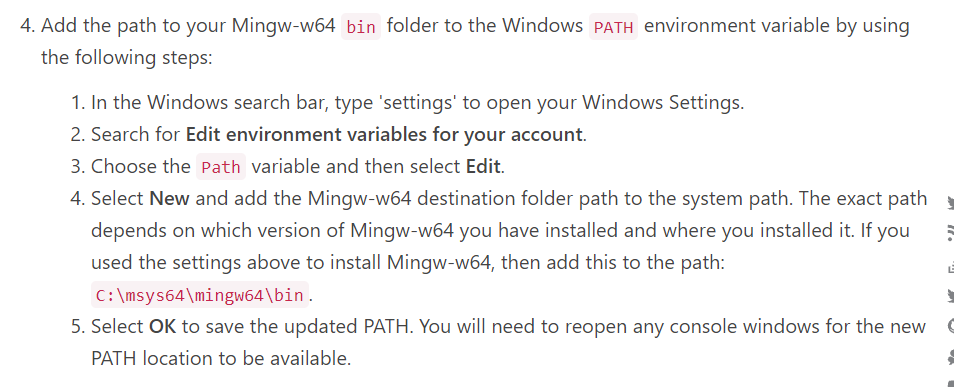
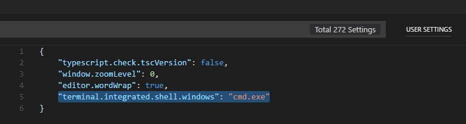

## 1) Теглим VS Code 
Стандартна инсталация от техния официалн сайт:
https://code.visualstudio.com/

## 2) Теглим компилатор - MinGW
Отновно стандартна инсталация първоначално от техният официален сайт:
https://sourceforge.net/projects/mingw/

При появата на този прозорец

 &nbsp;&nbsp;&nbsp;&nbsp;&nbsp;&nbsp;&nbsp;&nbsp;&nbsp;&nbsp;&nbsp;&nbsp;&nbsp;&nbsp;&nbsp;&nbsp;&nbsp;&nbsp;&nbsp;&nbsp;&nbsp;&nbsp;&nbsp;&nbsp;&nbsp;&nbsp;&nbsp;&nbsp;&nbsp;&nbsp;&nbsp;&nbsp;

Маркирате с тикчета всичките пакети, след което натискате <br>
<b>Installation -> Apply Changes -> Apply.</b> <br>
Така започват да ви се теглят пакетите за компилатора.

## 3) Конфигурация на компилатора

Нагледно стъпките

 &nbsp;&nbsp;&nbsp;&nbsp;&nbsp;&nbsp;&nbsp;&nbsp;&nbsp;&nbsp;&nbsp;&nbsp;&nbsp;&nbsp;&nbsp;&nbsp;&nbsp;&nbsp;&nbsp;&nbsp;&nbsp;&nbsp;&nbsp;&nbsp;&nbsp;&nbsp;&nbsp;&nbsp;&nbsp;&nbsp;&nbsp;&nbsp;


1. В Windows търсачката намирате Edit environments variables for your account
2. Натискате New и за Variable name пишете PATH и цъкате Browse Directory като намирате локацията на bin папката в MinGW (по default e C:\MinGW\bin)
3. Натистаке окей и рестартирате терминал/vs code ако ви е бил пуснат
4. За да е успешно готов компилатора, напишете в терминала g++ --version и ако ви излезе версия значи всичко е наред


## 4) Променяне на терминала от powershell към cmd (стандартния command prompt)

Във VS Code натискате в горния ляв ъгъл <br>
<b>File -> Preferences -> Settings </b><br>
Горе в търсачката търсите: <b>"terminal.integrated.shell" </b><br>

Избирате опцията Windows и цъкате Edit in settings.json
 &nbsp;&nbsp;&nbsp;&nbsp;&nbsp;&nbsp;&nbsp;&nbsp;&nbsp;&nbsp;&nbsp;&nbsp;&nbsp;&nbsp;&nbsp;&nbsp;&nbsp;&nbsp;&nbsp;&nbsp;&nbsp;&nbsp;&nbsp;&nbsp;&nbsp;&nbsp;&nbsp;&nbsp;&nbsp;&nbsp;&nbsp;&nbsp;

Добавяте на последен ред <br>
<b>"terminal.integrated.shell.windows": "cmd.exe"</b>

 &nbsp;&nbsp;&nbsp;&nbsp;&nbsp;&nbsp;&nbsp;&nbsp;&nbsp;&nbsp;&nbsp;&nbsp;&nbsp;&nbsp;&nbsp;&nbsp;&nbsp;&nbsp;&nbsp;&nbsp;&nbsp;&nbsp;&nbsp;&nbsp;&nbsp;&nbsp;&nbsp;&nbsp;&nbsp;&nbsp;&nbsp;&nbsp;

Сега като си добавите нов терминал от Terminal -> New Terminal трябва да ви е на cmd, а не на powershell :)

## 5) Пускане на първа програма

Когато имате main.cpp файла готов с Hello World в него
```c++
cout << "Hello World" << endl;
```
Компилирате от терминала с g++ main.cpp и рънвате програмата като пишете a.exe

 &nbsp;&nbsp;&nbsp;&nbsp;&nbsp;&nbsp;&nbsp;&nbsp;&nbsp;&nbsp;&nbsp;&nbsp;&nbsp;&nbsp;&nbsp;&nbsp;&nbsp;&nbsp;&nbsp;&nbsp;&nbsp;&nbsp;&nbsp;&nbsp;&nbsp;&nbsp;&nbsp;&nbsp;&nbsp;&nbsp;&nbsp;&nbsp;
