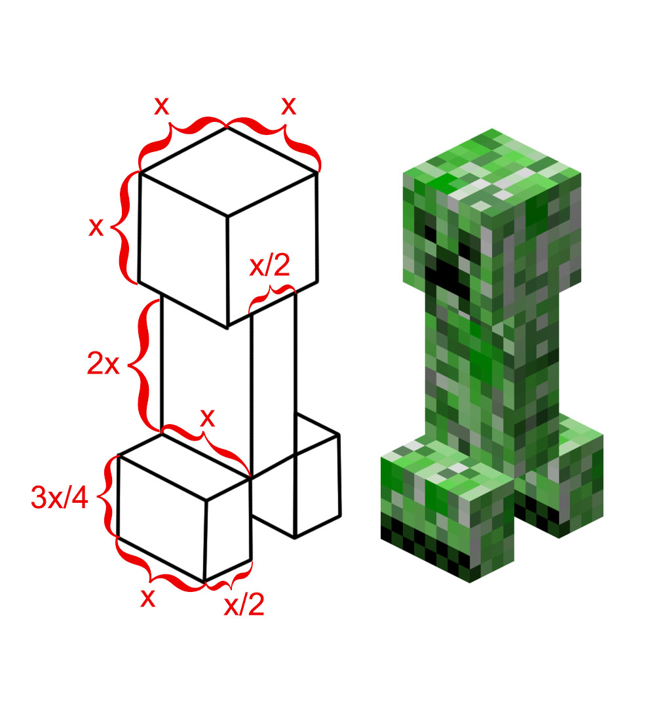

# Tasks

## Task 0
### Изведете на стандартния изход съобщение "Zdr FMI!"

## Task 1 - Геометрия
### Да се намерят лицето и обиколката на правоъгълник със страни дълги 10 см и 3 см

**Примерен изход :** Perimeter = 26, Area = 30

### Да се намерят лицето и обиколката на триъгълник със страни дълги 11 см и 17 см и 8см 

**Примерен изход :** Perimeter = 36, Area = 35.5

## Task 2 - Number swap
### Въведете две цели числа и разменете стойностите им (може да опитате без трета променлива :) )

**Примерен изход при въведени числа 10 и 15 :** 15 10

## Task 3 - Bigger number
### Въведете две цели числа и изведете в конзолата по - голямото от двете (без if else проверка тъй като не е учено още :) )

**Примерен изход при въведени числа 10 и 15 :** 15 10

## Task 4 - Трицифрени числа
### Да въведе трицифрено число, след което да се изведат на стандартния изход трите му цифри и сумата им.

**Примерен изход при числото 875 :** 8 7 5 -> 20

## Task 5 - Костенурки
### Напишете програма, която пресмята нужните разходи за закупуването на храна за костенурки. Храната се пазарува основно за костенурки, от зоомагазин, но понякога стопанинът им купува и за котките на съседката му. Една опаковка храна за костенурките е на цена 2.50лв., а всяка останала, която не е за тях струва 4лв.

**Примерен изход при вход 5 4 :** 28.50 lv.

**Примерен изход при вход 0 4 :** 16 lv.

**Примерен изход при вход 1 0 :** 2.50 lv.

* След като решите задачата вмъкнете 3-та променлива, която определя дали е Happy Hour, т.е ако **е** Happy Hour, да се изведе на екрана крайна сметка с 30% по - евтина

## Task 6 - От Целзий във Фаренхайт и обратно
### Напишете програма, която приема число, което ще е температура и в първия случай приемаме, че трябва от Целзий във Фаренхайт да премине, а във втория от Фаренхайт в Целзий (Как става това преминаване може да проверите в Гугъл :) )  

**Примерен изход при вход 0 :** From C to F -> 32.00 F, From F to C -> -17.777 C.

**Примерен изход при вход 15 :** From C to F -> 59.00 F, From F to C -> -9.44 C.

**Примерен изход при вход 32 :** From C to F -> 89.60 F, From F to C -> 0 C.

## Task 7 - Creeper
### Напишете програма, която пресмята обема на creeper от играта “Minecraft” по въведен от потребителя x. Знаем че главата нa creeper е куб със страна x, тялото му е паралелепипед със страни x, x/2 и 2x, a предните и задните му крака са със страни x, x/2 и 3x/4.
**Пояснение** - разглеждаме предните му два крака като един паралелепипед и задните два също.

**Примерен изход при вход 3 :** The creeper's volume is 74.25

**Примерен изход при вход 4 :** The creeper's volume is 176

**Примерен изход при вход 10 :** The creeper's volume is 2750

 &nbsp;&nbsp;&nbsp;&nbsp;&nbsp;&nbsp;&nbsp;&nbsp;&nbsp;&nbsp;&nbsp;&nbsp;&nbsp;&nbsp;&nbsp;&nbsp;&nbsp;&nbsp;&nbsp;&nbsp;&nbsp;&nbsp;&nbsp;&nbsp;&nbsp;&nbsp;&nbsp;&nbsp;&nbsp;&nbsp;&nbsp;&nbsp;
