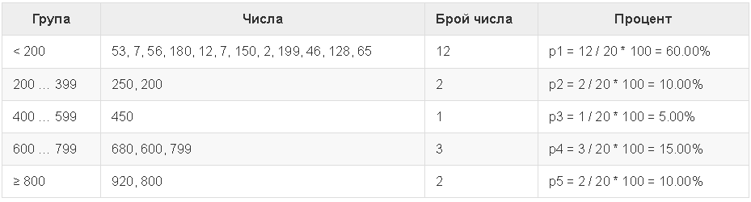

# Tasks - Week 6

## Task 1 - Playground

На площадката пред жилищен блок трябва да се поставят плочки. 

- Площадката е с форма на квадрат със страна N метра. 
- Плочките са широки „W“ метра и дълги „L“ метра. 
- На площадката има една пейка с ширина M метра и дължина O метра. Под нея не е нужно да се слагат плочки.
- Всяка плочка се поставя за 0.2 минути.

Напишете програма, която чете от конзолата размерите на площадката, плочките и пейката и пресмята колко плочки са необходими да се покрие площадката и пресмята времето за поставяне на всички плочки.

Пример: площадка с размер 20 м. има площ 400 кв.м.. Пейка, широка 1 м. и дълга 2 м., заема площ 2 кв.м. Една плочка е широка 5 м. и дълга 4 м. и има площ = 20 кв.м. Площта, която трябва да се покрие, е 400 – 2 = 398 кв.м. Необходими са 398 / 20 = 19.90 плочки. Необходимото време е 19.90 * 0.2 = 3.98 минути.

Пример 1:
```
Вход:   Изход:
20      19.9
5       3.98
4
1
2
```

Обяснение към примера:

- Обща площ = 20 * 20 = 400.
- Площ на пейката = 1 * 2 = 2.
- Площ за покриване = 400 – 2 = 398.
- Площ на плочки = 5 * 4 = 20.
- Необходими плочки = 398 \/ 20 = 19.9.
- Необходимо време = 19.9 * 0.2 = 3.98.

Пример 2:
```
Вход:   Изход:
40      3302.08333333333
0.8     660.416666666667
0.6
3
5
```

- Бонус: закръглете финалния резултат до второто число след десетичния запис.

## Task 2 - Transport
Студент трябва да пропътува n километра. Той има избор измежду три вида транспорт:

- Такси. Начална такса: 0.70 лв. Дневна тарифа: 0.79 лв./км. Нощна тарифа: 0.90 лв./км.
- Автобус. Дневна / нощна тарифа: 0.09 лв./км. Може да се използва за разстояния минимум 20 км.
- Влак. Дневна / нощна тарифа: 0.06 лв./км. Може да се използва за разстояния минимум 100 км.

Напишете програма, която въвежда броя километри n и период от деня (ден или нощ) и изчислява цената на най-евтиния транспорт.

Входни данни
От конзолата се четат два реда:

- Първият ред съдържа числото n – брой километри – цяло число в интервала [1 … 5000].
- Вторият ред съдържа число 1 или 0 пътуване през деня или през нощта.

Примери:

```
Вход:   Изход:
5       4.65
1
```
```
Вход:   Изход:
7       7
0
```
```
Вход:   Изход:
25      2.25
1
```
```
Вход:   Изход:
180     10.8
0
```

## Task 3 - Wine 
От лозе с площ X квадратни метри се заделя 40% от реколтата за производство на вино. От 1 кв.м. лозе се изкарват Y килограма грозде. За 1 литър вино са нужни 2,5 кг. грозде. Желаното количество вино за продан е Z литра.

Напишете програма, която пресмята колко вино може да се произведе и дали това количество е достатъчно. Ако е достатъчно, остатъкът се разделя по равно между работниците на лозето.

Входни данни
Входът се чете от конзолата и се състои от точно 4 реда:

- 1-ви ред: X кв.м е лозето – цяло число в интервала [10 … 5000].
- 2-ри ред: Y грозде за един кв.м. – реално число в интервала [0.00 … 10.00].
- 3-ти ред: Z нужни литри вино – цяло число в интервала [10 … 600].
- 4-ти ред: брой работници – цяло число в интервала [1 … 20].

На конзолата трябва да се отпечата следното:

Ако произведеното вино е по-малко от нужното:
“It will be a tough winter! More {недостигащо вино} liters wine needed.”
* Резултатът трябва да е закръглен към по-ниско цяло число.
Ако произведеното вино е повече от нужното:
“Good harvest this year! Total wine: {общо вино} liters.”
* Резултатът трябва да е закръглен към по-ниско цяло число.
“{Оставащо вино} liters left -> {вино за 1 работник} liters per person.”
* И двата резултата трябва да са закръглени към по-високото цяло число.

Примери:

Вход:
```
650
2
175
3
```
Изход:
```
Good harvest this year! Total wine: 208 liters.
33 liters left -> 11 liters per person.
```

Вход:

```
1020
1.5
425
4
```

Изход:
```
It will be a tough winter! More 180 liters wine needed.
```

## Task 4 - Histogram

Дадени са n цели числа в интервала [1 … 1000]. От тях някакъв процент p1 са под 200, процент p2 са от 200 до 399, процент p3 са от 400 до 599, процент p4 са от 600 до 799 и останалите p5 процента са от 800 нагоре. Да се напише програма, която изчислява и отпечатва процентите p1, p2, p3, p4 и p5.

Пример: имаме n = 20 числа: 53, 7, 56, 180, 450, 920, 12, 7, 150, 250, 680, 2, 600, 200, 800, 799, 199, 46, 128, 65. 

Получаваме следното разпределение и визуализация:



Примери:

Вход:
```
7
800
801
250
199
399
599
799
```
Изход:
```
14.29%
28.57%
14.29%
14.29%
28.57%
```

Вход:
```
4
53
7
56
999
```
Изход:
```
75.00%
0.00%
0.00%
0.00%
25.00%
```

## Task 5 Butterfly

Да се напише програма, която прочита от конзолата цяло число n и чертае пеперуда с ширина 2 * n - 1 колони и височина 2 * (n - 2) + 1 реда като в примерите по-долу. Лявата и дясната ѝ част са широки n - 1.

Примери:

Вход: 3

Изход:
```
*\ /*
  @  
*/ \*
```

Вход: 5

Изход:
```
***\ /***
---\ /---
***\ /***
    @    
***/ \***
---/ \---
***/ \***
`````