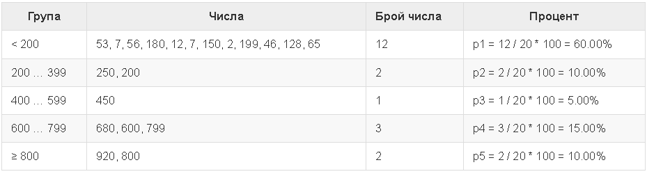

# Tasks - Week 6

## Task 1 - Playground

Tiles must be laid on the site in front of a block of flats.

- The site is in the shape of a square with side N meters.
- Tiles are 'W' meters wide and 'L' meters long.
- There is one bench on the site with a width of M meters and a length of O meters. There is no need to lay tiles under it.
- Each tile is placed in 0.2 minutes.

Write a program that reads from the console the dimensions of the square, the tiles and the bench and calculates how many tiles are needed to cover the square and calculates the time to place all the tiles.

Example: a 20m square. has an area of ​​400 sq.m.. A bench, 1 m wide. and 2 m long, occupies an area of ​​2 sq.m. One tile is 5 m wide. and 4 m long. and has an area = 20 sq.m. The area to be covered is 400 – 2 = 398 sq.m. 398 / 20 = 19.90 tiles are needed. The time required is 19.90 * 0.2 = 3.98 minutes.

Example 1:
```
Input: Output:
20     19.9
5      3.98
4
1
2
```

Explanation for the example:

- Total area = 20 * 20 = 400.
- Bench area = 1 * 2 = 2.
- Area to cover = 400 – 2 = 398.
- Area of ​​tiles = 5 * 4 = 20.
- Tiles required = 398 \/ 20 = 19.9.
- Time required = 19.9 * 0.2 = 3.98.

Example 2:
```
Input: Output:
40     3302.08333333333
0.8    660.416666666667
0.6
3
5
```

- Bonus: round the final result to the second decimal place.

## Task 2 - Transport
A student has to travel n kilometers. He has a choice of three types of transport:

- Taxis. Initial fee: BGN 0.70. Daily rate: BGN 0.79/km. Night rate: BGN 0.90/km.
- Bus. Day / night rate: BGN 0.09/km. It can be used for distances of at least 20 km.
- A train. Day / night rate: BGN 0.06/km. It can be used for distances of at least 100 km.

Write a program that enters the number of kilometers n and the time of day (day or night) and calculates the cost of the cheapest transport.

Input data
Two lines are read from the console:

- The first line contains the number n – number of kilometers – an integer in the interval [1 … 5000].
- The second line contains the number 1 or 0 travel during the day or at night.

Examples:

```
Input: Output:
5      4.65
1
```
```
Input: Output:
7      7
0
```
```
Input: Output:
25     2.25
1
```
```
Input: Output:
180    10.8
0
```

## Task 3 - Wine
From a vineyard with an area of ​​X square meters, 40% of the harvest is set aside for wine production. From 1 sq.m. vineyard yields Y kilograms of grapes. 2.5 kg are needed for 1 liter of wine. grapes. The desired quantity of wine to sell is Z liters.

Write a program that calculates how much wine can be produced and whether this amount is sufficient. If there is enough, the remainder is divided equally among the vineyard workers.

Input data
The input is read from the console and consists of exactly 4 lines:

- 1st line: X sq.m is the vineyard - an integer in the interval [10 … 5000].
- 2nd row: Y grapes for one sq.m. – a real number in the interval [0.00 … 10.00].
- 3rd line: Z required liters of wine – an integer in the interval [10 … 600].
- 4th row: number of workers – an integer in the interval [1 … 20].

The following should be printed on the console:

If the wine produced is less than required:
"It will be a tough winter! More {insufficient wine} liters wine needed.”
* The result must be rounded to a lower integer.
If the wine produced is more than needed:
"Good harvest this year! Total wine: {total wine} liters.”
* The result must be rounded to a lower integer.
“{Remaining wine} liters left -> {wine for 1 worker} liters per person.”
* Both results should be rounded to the higher integer.

Examples:

Input:
```
650
2
175
3
```
Output:
```
Good harvest this year! Total wine: 208 liters.
33 liters left -> 11 liters per person.
```

Input:

```
1020
1.5
425
4
```

Output:
```
It will be a tough winter! More 180 liters of wine needed.
```

## Task 4 - Histogram

Given n integers in the interval [1 … 1000]. Of these, some percentage p1 are below 200, percentage p2 are from 200 to 399, percentage p3 are from 400 to 599, percentage p4 are from 600 to 799 and the remaining p5 percentage are from 800 and up. To write a program that calculates and prints the percentages p1, p2, p3, p4 and p5.

Example: we have n = 20 numbers: 53, 7, 56, 180, 450, 920, 12, 7, 150, 250, 680, 2, 600, 200, 800, 799, 199, 46, 128, 65.

We get the following distribution and visualization:



Examples:

Input:
```
7
800
801
250
199
399
599
799
```
Output:
```
14.29%
28.57%
14.29%
14.29%
28.57%
```

Input:
```
4
53
7
56
999
```
Output:
```
75.00%
0.00%
0.00%
0.00%
25.00%
```

## Task 5 Butterfly

Write a program that reads an integer n from the console and draws a butterfly with a width of 2 * n - 1 columns and a height of 2 * (n - 2) + 1 rows as in the examples below. Its left and right parts are n - 1 wide.

Examples:

Input: 3

Output:
```
*\ /*
  @
*/ \*
```

Input: 5

Output:
```
***\ /***
---\ /---
***\ /***
    @
***/ \***
---/ \---
***/ \***
```
